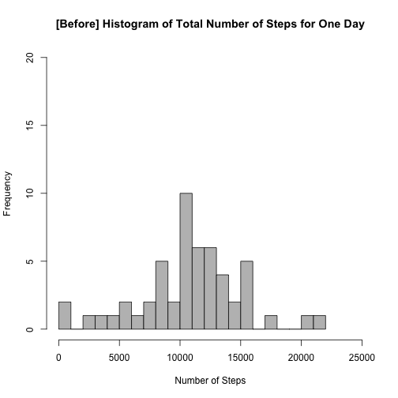
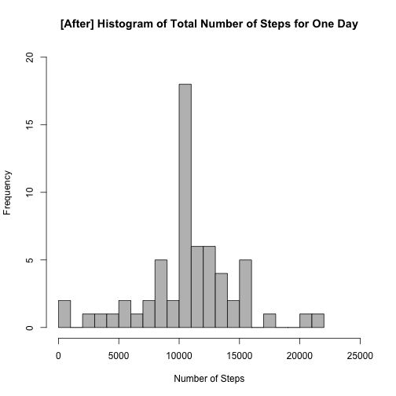
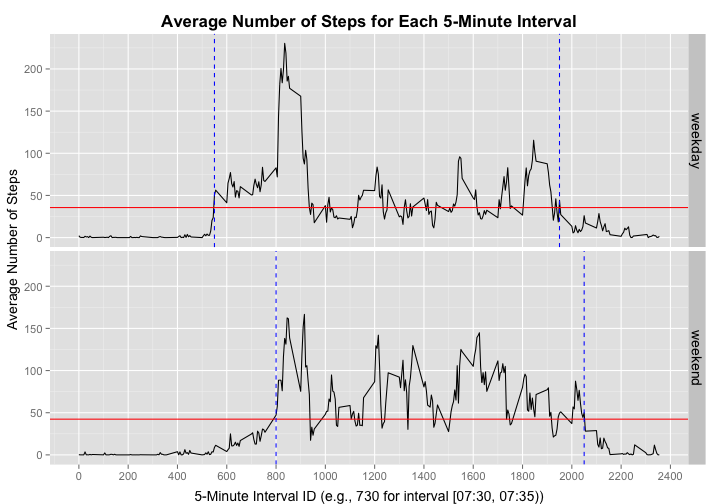

# Reproducible Research: Peer Assessment 1
Author: Coursera student [RyanLeiTaiwan](https://www.coursera.org/user/i/adc3888c696d25d769137c26e7006fd8)

## Loading and preprocessing the data
* Load the data (i.e. `read.csv()`). Make sure you have set the working directory correctly by `setwd()`:

```r
if (!exists("activity.csv")) {
    unzip("activity.zip")
}
```

```
## Warning in unzip("activity.zip"): error 1 in extracting from zip file
```

```r
dat <- read.csv("activity.csv", na.strings = "NA")
```
* Process/transform the data (if necessary) into a format suitable for your analysis:
  * Transform the date into Date class.

```r
dat$date <- as.Date(dat$date, "%Y-%m-%d")
```

## What is mean total number of steps taken per day?
* Make a histogram of the total number of steps taken each day:
  * Use `aggregate()` to sum the number of steps for each day.
  * The instruction says **"you can ignore the missing values in the dataset"**. I interpret this as DISCARDING the empty days and don't treat them as **zeros**.
  * *Reasoning*: In our dataset, NA's appear when the entire day consists of NA's. So if you do not perform the experiment on a specific day at all, why counting it for the mean and median? **No measurement** is different from **a measurement of zero step**.

```r
sumEachDay <- aggregate(steps ~ date, dat, sum)
hist(sumEachDay$steps, col = "grey", breaks = 20,
    xlab = "Number of Steps", xlim = c(0, 25000), ylim = c(0, 20), 
    main = "[Before] Histogram of Total Number of Steps for One Day")
```

 

* Calculate and report the mean and median total number of steps taken per day.

```r
mean(sumEachDay$steps, na.rm = TRUE)
```

```
## [1] 10766.19
```

```r
median(sumEachDay$steps, na.rm = TRUE)
```

```
## [1] 10765
```

## What is the average daily activity pattern?
* Make a time series plot (i.e. `type = "l"`) of the 5-minute interval (x-axis) and the average number of steps taken, averaged across all days (y-axis)

```r
meanEachInterval <- aggregate(steps ~ interval, dat, mean)
plot(meanEachInterval$interval, meanEachInterval$steps, type = "l", xaxt = "n", 
    xlab = "5-Minute Interval ID (e.g., 730 for interval [07:30, 07:35))", ylab = "Average Number of Steps", 
    main = "Average Number of Steps for Each 5-Minute Interval")
axis(1, c(seq(0, 2400, 200)))
```

 

* Which 5-minute interval, on average across all the days in the dataset, contains the maximum number of steps?
  * Use `which.max()` to find the row containing the maximum. Then subset that row.

```r
meanEachInterval[which.max(meanEachInterval$steps),]
```

```
##     interval    steps
## 104      835 206.1698
```

## Imputing missing values
* Calculate and report the total number of missing values in the dataset (i.e. the total number of rows with `NA`s)

```r
sum(is.na(dat$steps))
```

```
## [1] 2304
```

* Devise a strategy for filling in all of the missing values in the dataset. The strategy does not need to be sophisticated. For example, you could use the mean/median for that day, or the mean for that 5-minute interval, etc.
  * **My strategy: Replace NA's with the mean for that 5-minute interval.**
  * *Downside*: the 8 empty days will be filled in with exactly the SAME estimates since these 8 days have NA's for ALL intervals. But a good estimation strategy is not the purpose of this assignment.

* Create a new dataset that is equal to the original dataset but with the missing data filled in.
  * For each interval, find the indices where the steps are NA's in this interval.
  * Replace the NA's in these indices with the steps values looked up in `meanEachInterval`.

```r
newDat <- dat
for (int in seq(0, 2355, 5)) {
    idx <- which(newDat$interval == int & is.na(newDat$steps))
    newDat[idx, "steps"] <- meanEachInterval[meanEachInterval$interval == int, "steps"]
}
```

* Make a histogram of the total number of steps taken each day and Calculate and report the mean and median total number of steps taken per day. Do these values differ from the estimates from the first part of the assignment? What is the impact of imputing missing data on the estimates of the total daily number of steps?

```r
newSumEachDay <- aggregate(steps ~ date, newDat, sum)
hist(newSumEachDay$steps, col = "grey", breaks = 20,
    xlab = "Number of Steps", xlim = c(0, 25000), ylim = c(0, 20), 
    main = "[After] Histogram of Total Number of Steps for One Day")
```

 

```r
mean(newSumEachDay$steps, na.rm = TRUE)
```

```
## [1] 10766.19
```

```r
median(newSumEachDay$steps, na.rm = TRUE)
```

```
## [1] 10766.19
```
### Explanations
* As mentioned in the *downside*, ALL the 8 empty days are all filled in with the same estimates, so the total number of steps in these 8 days are all 10766.19, which equals the mean in `sumEachDay`. Therefore, the **new histogram** makes ONLY the mean-value bin higher.
* The **new mean** value is the same because adding the mean values to the original dataset does not change the mean.
* The **new median** value becomes the *mean* value because 8 mean values are added into the dataset. After sorting, these 8 values will likely dominate in the middle and be picked as the median.

## Are there differences in activity patterns between weekdays and weekends?
* Use the dataset with the filled-in missing values (`newDat`) for this part.
  * Create a new factor variable in the dataset with two levels – “weekday” and “weekend” indicating whether a given date is a weekday or weekend day.
  * First, use `format(date, "%u")` to create a character variable of 7 values (`"1", "2", ..., "7"`). Characters produced by `weekdays()` will be *locale-dependent* and are not preferable.
  * Then, redefine the 5 weekdays as `"weekday"`, the 2 weekends as `"weekend"`.
  * Finally, convert the character variable into a factor variable of 2 levels.

```r
newDat$weekXXX <- format(newDat$date, "%u")
newDat$weekXXX[newDat$weekXXX %in% 1:5] <- "weekday"
newDat$weekXXX[newDat$weekXXX %in% 6:7] <- "weekend"
newDat$weekXXX <- as.factor(newDat$weekXXX)
```

* Make a panel plot containing a time series plot (i.e. `type = "l"`) of the 5-minute interval (x-axis) and the average number of steps taken, averaged across all weekday days or weekend days (y-axis).
  * Also plot/calculate the means.
  * Plot the first and last intervals when the average number of steps are above the means.

```r
library(ggplot2)
library(grid)

options(scipen = 1000)
newMeanEachInterval <- aggregate(steps ~ weekXXX + interval, newDat, mean)
# Means of weekdays and weekends
meanWeekday <- mean(subset(newMeanEachInterval, weekXXX == "weekday")$step)
meanWeekend <- mean(subset(newMeanEachInterval, weekXXX == "weekend")$step)
# See "Explanations" below: Find the first and last intervals when the steps are above their means
startWeekday <- min(subset(newMeanEachInterval, weekXXX == "weekday" & steps >= meanWeekday)$interval)
endWeekday <- max(subset(newMeanEachInterval, weekXXX == "weekday" & steps >= meanWeekday)$interval)
startWeekend <- min(subset(newMeanEachInterval, weekXXX == "weekend" & steps >= meanWeekend)$interval)
endWeekend <- max(subset(newMeanEachInterval, weekXXX == "weekend" & steps >= meanWeekend)$interval)
# Lines we use for annotations
hvlines <- data.frame(weekXXX = c("weekday", "weekend"), mean = c(meanWeekday, meanWeekend),
    start = c(startWeekday, startWeekend),
    end = c(endWeekday, endWeekend))

ggplot(newMeanEachInterval, aes(interval, steps)) + geom_line() + facet_grid(weekXXX ~ .) +
    geom_hline(aes(yintercept = mean), data = hvlines, col = "red") + 
    geom_vline(aes(xintercept = start), data = hvlines, col = "blue", linetype = "dashed") +
    geom_vline(aes(xintercept = end), data = hvlines, col = "blue", linetype = "dashed") +
    labs(x = "5-Minute Interval ID (e.g., 730 for interval [07:30, 07:35))", y = "Average Number of Steps", 
    title = "Average Number of Steps for Each 5-Minute Interval") +
    scale_x_continuous(breaks = seq(0, 2400, 200)) +
    theme(text = element_text(size = 14), strip.text = element_text(size = 14), 
    axis.title.x = element_text(vjust = -0.5), axis.title.y = element_text(vjust = +1.0),
    title = element_text(vjust = +1.0), plot.title = element_text(face = "bold"))
```

 

```r
c(meanWeekday, meanWeekend)
```

```
## [1] 35.61058 42.36640
```
### Explanations
Although there is a higher peek on weekdays around 08:30, the overall mean `(red line)` is actually higher on weekends. Here's one reasoning:

* During weekdays, the **commuting hours** in the morning (08:30) and evening (18:30) contribute to the higher peaks, but in other **office hours**, the users produce relatively less amount of activities.
* During weekends, however, there is not much effect of commuting hours. The holiday activities are spread more evenly among the daytime hours, and the overall amount is higher.
* In addition, on weekdays, people get up and rest earlier than on weekends. This can be told by the intervals when the number of steps increase above the mean or decrease below the mean `(blue line)`.


